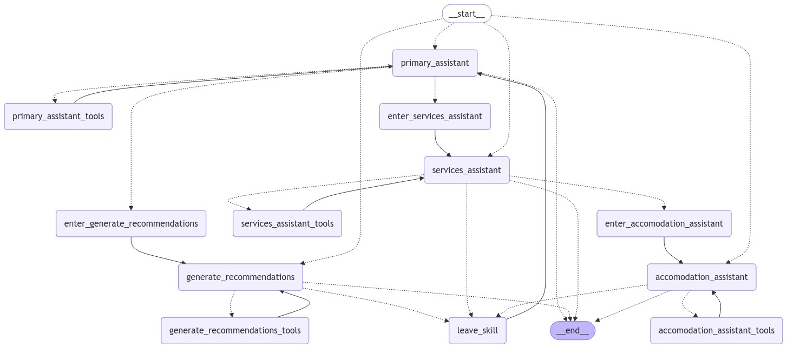

# Travel Planner

## Description
This project consists of a Telegram chatbot intended  to help users plan their trips, using information about the user's background, interests, schedule and budget, among others, to give personalized recommendations about places to visit and suggest day-by-day itineraries, as well as offer help finding accomodation services, tours and flights.

Talk to the bot on Telegram: https://t.me/TravelPlannerARBot

## Tech stack
* [Langgraph](https://www.langchain.com/langgraph) was the framework chosen to build the multi-agent architecture, due to it's flexibility to add, edit and remove agents and connections between them.
* [MongoDB](https://www.mongodb.com/) is used to persist the chat memory, leveraging MongoAtlas for cloud storage. The use of Mongo required the implementation of a custom checkpointer, as Langgraph offers only SQLServer and SQLite options.
* For the deployment of the agent, an Azure Function was used, as it allows for serverless computing, meaning that billing is based only on usage.
* Finally, the chatbot was integrated into a Telegram bot.
* The bot performance is continously evaluated using Langsmith, by analyzing each agent on it's own, allowing the improvement of each indivual component.

## Architecture
The system is based on the supervisor design pattern, widely used for multi-agent apps. It's composed of a primary assistant, that receives users' queries and, based on its content, it can:
  * use its own tools to generate the answer
  * delegate the task to recommendations assistant: if the user wants general recommendations about touristic places, itineraries, attraction, etc. Example queries that would follow this flow:
    ** I have 2 days to visit Paris, what should i prioritize?
  * delegate the task to the services assistant: if the user is requesting information about services, like accommodation, flights, tours, etc.
    ** where can I stay in New York with a low budget?

The sevices assistant will take the query and:
* use it's own tools
* delegate the task to the specialized agents, each one specific for a type of service (NOTE: so far only the accomodation asssistant is implemented)

Each time the user sends a message, the conversation is resumed by the agent where it left, thanks to the definition of the Langgraph state.
Each agent can retun the conversation back to the primary assistant once it finished it's task.

